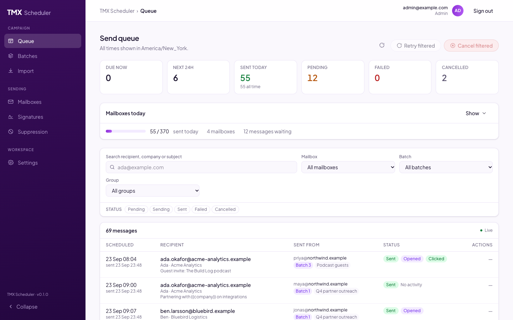
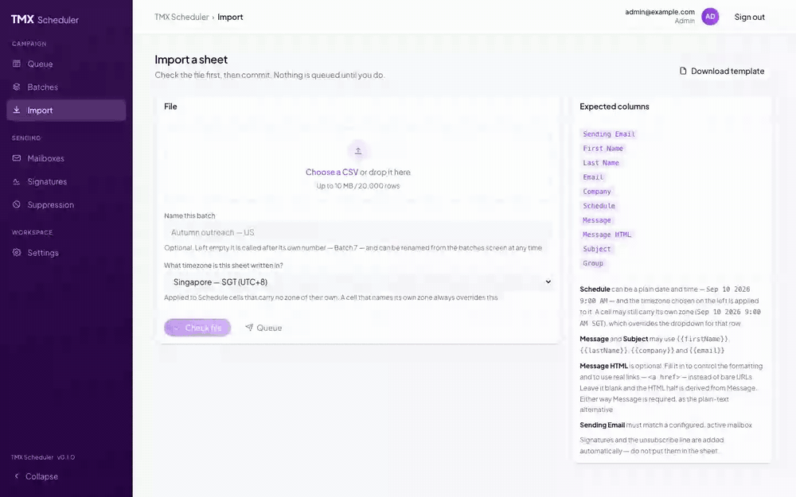
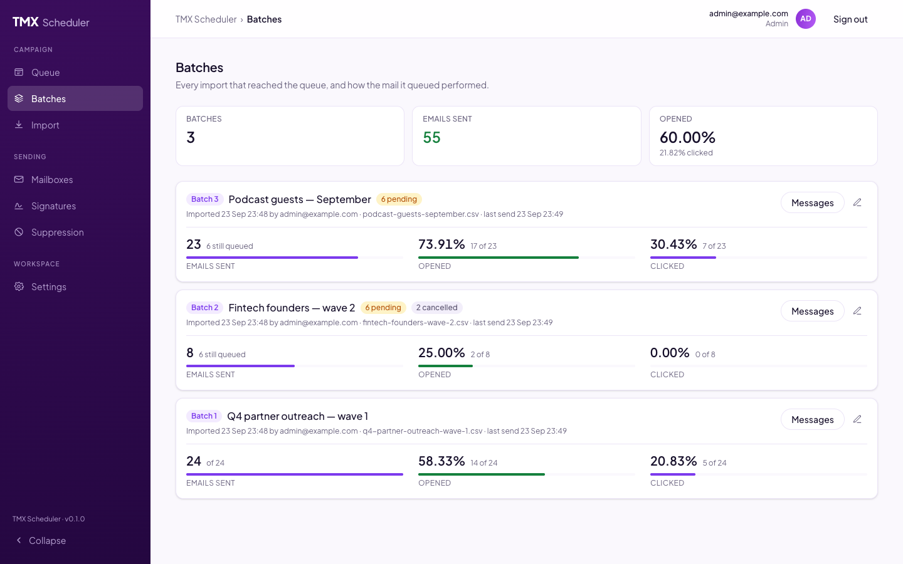
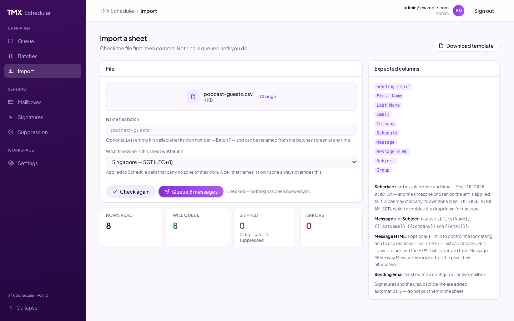
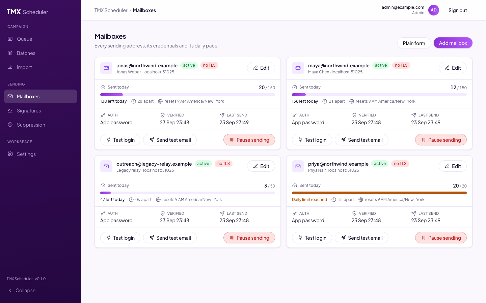
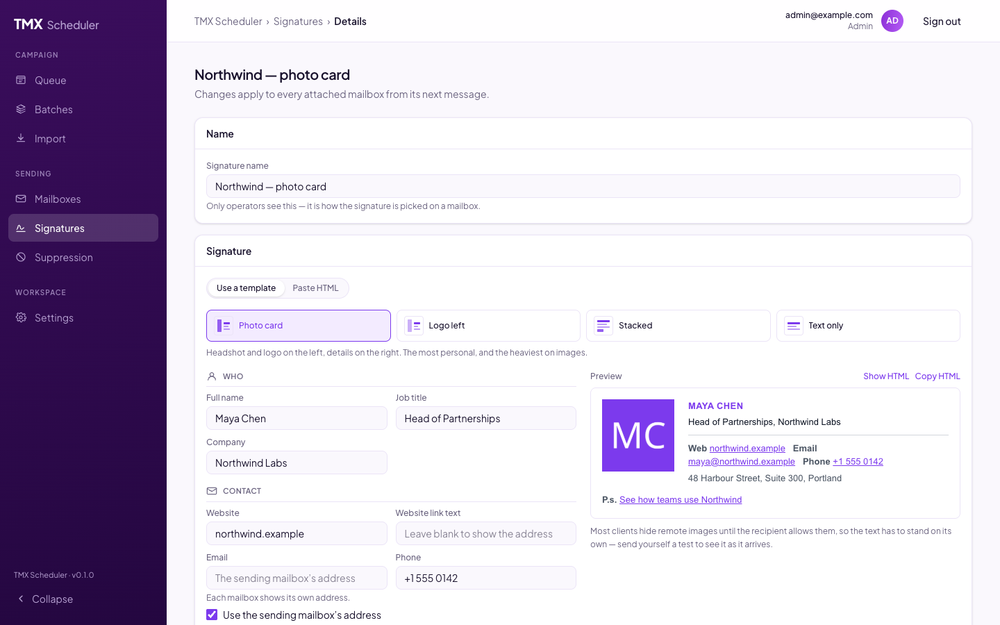
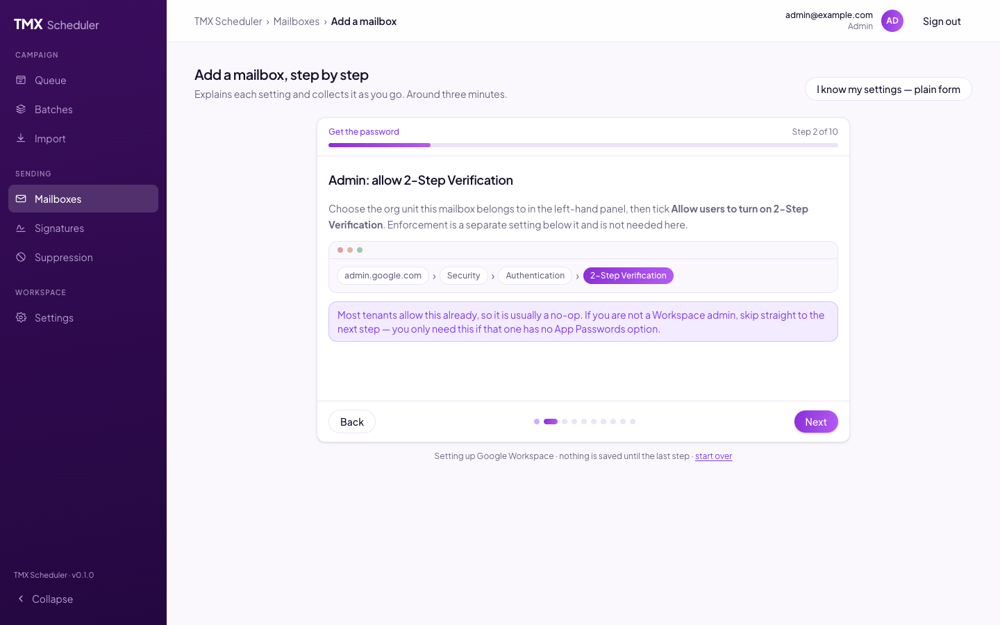

# TMX Scheduler

[](https://github.com/TokenMinds-co/tmx-scheduler/actions/workflows/ci.yml)
[](LICENSE)

**Self-hosted outreach email scheduler.** Import a spreadsheet, send each row
at its scheduled time from one of several company mailboxes over SMTP, keep
every mailbox under its own daily limit, and see who opened and clicked — with
the security scanners filtered out.

Runs on your own server against your own mailboxes (Google Workspace,
Microsoft 365, Zoho, or any SMTP relay). No third party holds your credentials
or your recipient list.



## What it does

- **Import a sheet, check it first.** Every row names its sending mailbox,
  recipient, send time, subject and message, with `{{firstName}}`-style
  personalisation. The check runs the full validation and queues nothing.
- **Send from several mailboxes, each with its own pace.** A daily limit, a
  warm-up default and a minimum gap between sends — enforced in one atomic
  database statement, so many workers can never overshoot together.
- **Retry, defer and give up sensibly.** Transient SMTP failures retry with
  backoff; a mailbox at its limit defers to tomorrow; a hard bounce suppresses
  the address and cancels everything still queued for it.
- **One-click unsubscribe** that Gmail and Outlook render natively
  (RFC 8058), which also cancels the recipient's remaining mail.
- **Opens and clicks, minus the scanners.** Every hit is stored with its
  evidence and judged on read, so a corporate mail gateway fetching your links
  does not count as a person.
- **Signatures that survive Outlook**, built from a template with a live
  preview, or pasted in and sanitised.
- **Guided mailbox setup** that reads the sending domain's DNS to work out the
  provider and walks through creating an app password for it.
- **Nothing escapes in development.** Mailpit catches every send locally.

## See it work

A sheet goes in, the queue picks it up, the batch reports back:



<table>
  <tr>
    <td width="50%">
      
      <p align="center"><sub><b>Batches</b> — every import, and how the mail it queued performed</sub></p>
    </td>
    <td width="50%">
      
      <p align="center"><sub><b>Import</b> — checked first; nothing is queued until you say so</sub></p>
    </td>
  </tr>
  <tr>
    <td width="50%">
      
      <p align="center"><sub><b>Mailboxes</b> — each sender's limit, pace and last send at a glance</sub></p>
    </td>
    <td width="50%">
      
      <p align="center"><sub><b>Signatures</b> — pick a layout, fill it in, see exactly what recipients get</sub></p>
    </td>
  </tr>
  <tr>
    <td width="50%" colspan="2">
      
      <p align="center"><sub><b>Add a mailbox</b> — detects the provider from DNS, then explains each setting as it collects it</sub></p>
    </td>
  </tr>
</table>

## Quick start

You need Node 22 (`.nvmrc`), pnpm (`corepack enable` installs the pinned
version) and Docker.

```bash
git clone https://github.com/TokenMinds-co/tmx-scheduler.git && cd tmx-scheduler
pnpm install
pnpm setup                                   # env files with fresh secrets; prints the admin password
pnpm infra:up                                # Postgres, Redis and Mailpit, all on 127.0.0.1
pnpm --filter @tmx-scheduler/shared build    # both apps import the built contracts
pnpm --filter backend db:migrate             # creates the tables
pnpm dev                                     # API on :4000, UI on :3000
```

Sign in at <http://localhost:3000> with the email and password `pnpm setup`
printed. The first admin is created on boot whenever no user exists.

### Try a demo campaign

Five minutes, nothing leaves your machine — Mailpit at <http://localhost:8025>
catches it all.

1. **Add a mailbox.** Mailboxes → _Plain form_. Any address you like, SMTP host
   `localhost`, port `1025`, any username and password, **Require TLS off**.
   The login check passes because Mailpit accepts everything.
2. **Get a sheet.** Import → _Download template_. It comes pre-filled with
   that mailbox as the sender and two sample rows.
3. **Check it, then queue it.** Drop the file on the import page, press
   _Check file_, read the counts, press _Queue_. The sample rows are dated in
   the past, so they go out straight away.
4. **Watch it send.** The queue flips the rows from _Pending_ to _Sent_ within
   a few seconds; Mailpit shows the messages with the unsubscribe footer in
   place (and a signature, if you attached one to the mailbox).
5. **Read the batch.** Batches shows what was delivered. Open a message in
   Mailpit and follow its link: the fetch is recorded, but the batch reports
   it as a scanner rather than a person — it came seconds after the send,
   from the machine that sent it. That is the filter working.

Then point a real mailbox at it: _Add mailbox_ reads your domain's DNS and
walks you through the provider's app password.

## Import format

| Column                         | Notes                                                                                              |
| ------------------------------ | -------------------------------------------------------------------------------------------------- |
| Sending Email                  | Must match a configured, active mailbox                                                            |
| First Name, Last Name, Company | Optional, used for personalisation                                                                 |
| Email                          | Recipient                                                                                          |
| Schedule                       | A date and time; the zone comes from the import screen unless the cell carries its own             |
| Message, Message HTML          | Plain text is required; HTML is optional and sanitised; both take the same placeholders as Subject |
| Subject                        | May use `{{firstName}}`, `{{lastName}}`, `{{company}}`, `{{email}}`                                |
| Group                          | Campaign label; drives filtering and bulk actions                                                  |

A schedule cell may carry its own zone (`9:00 AM SGT`, `2026-09-10T09:00+08:00`
or an IANA name), which always wins over the dropdown. A zone that is present
but unrecognised **rejects the row** rather than guessing. Re-importing a sheet
never mails the same person twice: duplicates are keyed on mailbox, recipient,
subject and group — deliberately not on the send time.

## Deliverability

The tool enforces what it can; the rest is operational discipline.

- **Warm up.** New mailboxes default to 20/day. Raise ~20% a week.
- **Pace.** 30–90 seconds between sends; jitter is added automatically.
- **Authenticate the domain.** SPF, DKIM and DMARC must be published or mail
  is spam-foldered regardless of anything here.
- **Spread a campaign across mailboxes** rather than maxing one out.

Cold outreach from Gmail and Google Workspace runs against their bulk-sender
terms independently of CAN-SPAM, GDPR or PECR obligations. That is a decision
for whoever runs the campaign, not something the tool can settle — it sends
what you schedule, to whom you schedule it.

## Configuration

`pnpm setup` writes `backend/.env` from `backend/.env.example`, which documents
every variable. The ones that matter in production:

| Variable                                              | Purpose                                                                                       |
| ----------------------------------------------------- | --------------------------------------------------------------------------------------------- |
| `DATABASE_URL`, `REDIS_URL`                           | Postgres and Redis. Default to the local `docker-compose.yml` services.                       |
| `CREDS_KEY`                                           | 32 bytes base64. Encrypts stored mailbox secrets at rest (AES-256-GCM).                       |
| `JWT_SECRET`, `UNSUBSCRIBE_SECRET`, `TRACKING_SECRET` | Three separate keys, so no token issued for one purpose is valid for another.                 |
| `PUBLIC_API_URL`, `TRACKING_BASE_URL`                 | What recipients see in unsubscribe and tracking links. Use a subdomain of the sending domain. |
| `CORS_ORIGINS`                                        | The admin UI's origin.                                                                        |
| `SEND_CONCURRENCY`, `POLL_INTERVAL_MS`                | Worker ceiling across all mailboxes; poller cadence.                                          |
| `DRY_RUN_SENDING`                                     | Log messages instead of sending. Use for a first run against real data.                       |

## Commands

```bash
pnpm dev              # both apps, watching
pnpm test             # backend unit tests
pnpm typecheck        # every package
pnpm lint             # ESLint
pnpm format:check     # Prettier (`pnpm format` rewrites)
pnpm build            # shared -> backend -> frontend
pnpm infra:up / :down # local Postgres, Redis and Mailpit

pnpm --filter backend db:migrate   # create/apply a migration in development
pnpm --filter backend db:deploy    # apply pending migrations (production)
pnpm --filter backend db:studio    # browse the data
```

## Deployment

The backend ships as a Docker image, `ghcr.io/tokenminds-co/tmx-scheduler-backend`;
the frontend is a standard Next.js app. **[docs/deployment.md](docs/deployment.md)**
covers the image, running it with Docker Compose against your own Postgres and
Redis, the frontend, and the GitHub Actions pipeline this repository deploys
itself with.

## How it is built

NestJS + Prisma on Postgres for the API and the schedule; BullMQ on Redis for
work that is due right now; Next.js for the admin UI; Nodemailer for SMTP.
Postgres holds the schedule and Redis only ever holds what is due, so a
pending message can be cancelled or rescheduled with one row update; every
claim — a due row, a mailbox's send slot — is a single atomic statement, so
any number of workers can run without a lock.

**[docs/architecture.md](docs/architecture.md)** is the design record: the
queue, throttling, failure handling, signatures, tracking, database and
security decisions, each with the reasoning.

## Roadmap

Known gaps, each an open issue:

- **Reply detection** — a recipient who answers should drop out of the
  campaign. Needs IMAP or the Gmail / Microsoft Graph APIs.
- **Asynchronous bounces** — a delivery-status notification arriving after
  the SMTP transaction is not read yet.
- **OAuth consent flow** — XOAUTH2 sending works, but the refresh token is
  pasted into the form today.
- **Frontend image**, **frontend tests**, and a **configurable default
  timezone** for new mailboxes.

Issues labelled [`good first issue`](https://github.com/TokenMinds-co/tmx-scheduler/labels/good%20first%20issue)
are scoped for a first contribution.

## Contributing and security

[CONTRIBUTING.md](CONTRIBUTING.md) covers setup, conventions and the pull
request flow; everyone taking part is expected to follow the
[code of conduct](CODE_OF_CONDUCT.md). Report vulnerabilities privately as
described in [SECURITY.md](SECURITY.md), not in a public issue.

## License

[MIT](LICENSE).
